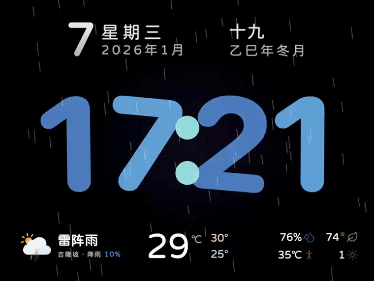
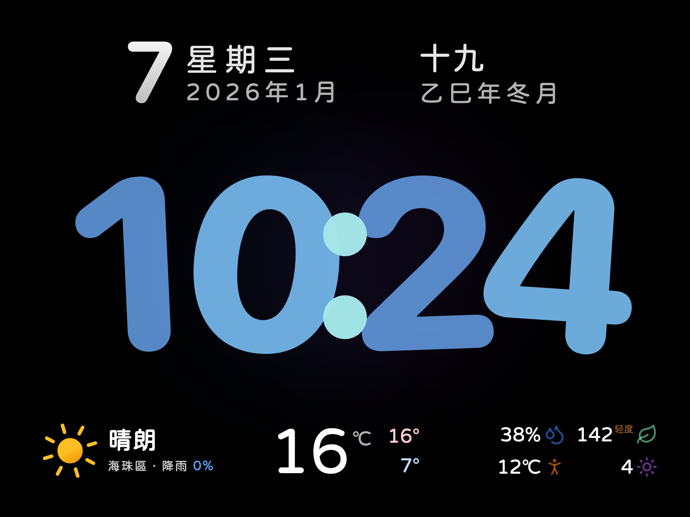
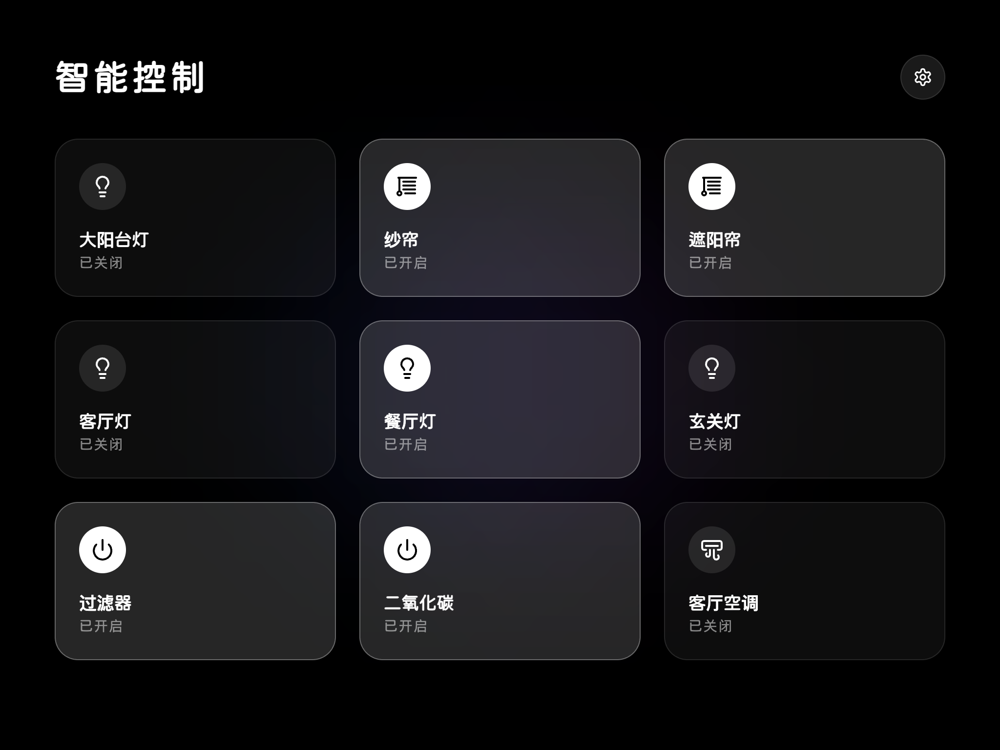
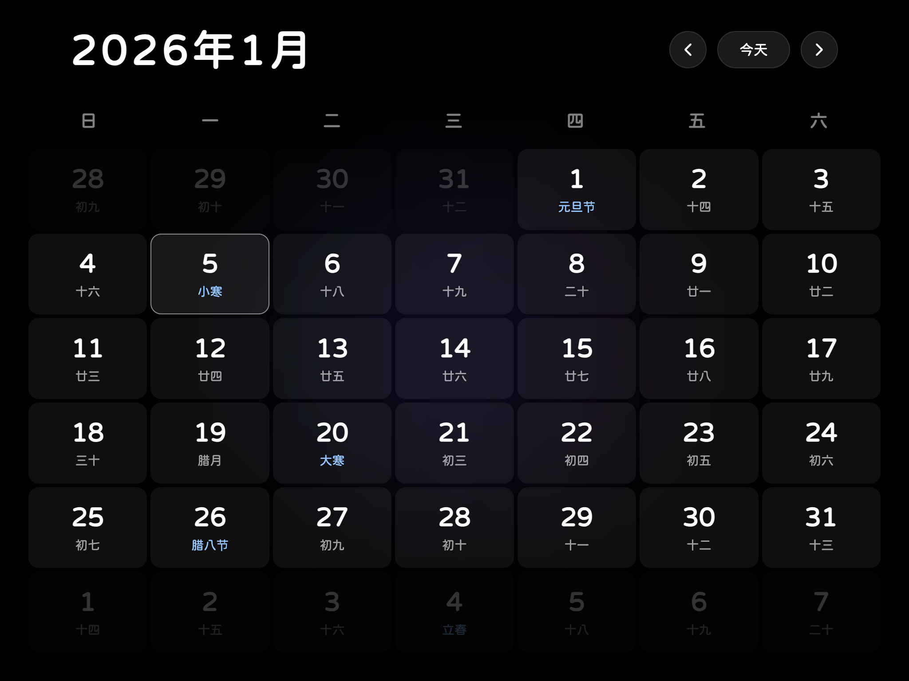

# Clock Dashboard | 天气时钟看板

[](LICENSE)
[](https://vuejs.org/)
[](https://vitejs.dev/)
[](https://github.com/teojs/clock-dashboard/releases)


一个基于 Vue 3 + TypeScript + Vite + Tailwind CSS 构建的在线天气时钟看板。
将闲置旧 iPad 变为时钟看板，支持天气、农历、日历、Home Assistant 智能设备控制（通过左右滑动切换页面）。

**🌐 在线地址：** [https://teojs.github.io/clock-dashboard/](https://teojs.github.io/clock-dashboard/)

**👏 欢迎加入讨论：** [QQ群(1018023465) ↗](https://qm.qq.com/q/x6hf1Evdni)

🌟 如果本项目对你有帮助，不妨点点Star，或者[请我喝杯咖啡☕️](#%EF%B8%8F-请我喝杯咖啡)

> ⚠️ 此项目用到 `Vue 3.x` 框架，这意味着最高系统为 iOS9.3.6 的 iPad mini 1 将无法支持，[只支持原生支持 ES2016 的浏览器](https://caniuse.com/es2016)， 目前仅在 iOS12 及更高版本测试通过。
>
> 如果您的设备系统为 iOS11 或更低版本，请使用 [https://github.com/teojs/clock-dashboard-vue2](https://github.com/teojs/clock-dashboard-vue2)。
>
> 💡 **隐私说明：**
> 本项目为纯前端项目，所有接口均为直连，不存在隐私泄露风险。
> 直接访问在线地址也可以安全使用 Home Assistant，无需私有部署。

---

## 📸 预览



|                时钟页面                 |                智能控制                 |                全屏日历                 |
| :-------------------------------------: | :-------------------------------------: | :-------------------------------------: |
|  |  |  |

---

## 🌟 特性

- **🕐 动态数字时钟**
  - 滚动动画和随机倾斜效果
  - 使用 [SF Compact Rounded](https://developer.apple.com/fonts/) 字体
  - 支持自定义时钟颜色
  - 支持 12 小时制

- **🌤️ 实时天气**
  - 天气数据来自 [Open-Meteo](https://open-meteo.com/)
  - 根据地理位置或通过 [BigDataCloud](https://www.bigdatacloud.com/) 查询 IP 获取位置
  - 显示温度、湿度、[空气指数（US AQI）](https://open-meteo.com/en/docs/air-quality-api)、体感温度、紫外线指数
  - 支持天气刷新间隔设置
  - 支持下雨、下雪、打雷特效开关
  - 点击底部天气区域可进行设置

- **📅 农历信息**
  - 集成 [lunar-typescript](https://github.com/6tail/lunar-typescript)
  - 提供精准的农历、干支年及节日显示

- **📆 全屏日历**
  - 内置万年历视图
  - 支持月份切换及今天快速跳转

- **🏠 智能家居控制**
  - 深度集成 Home Assistant
  - 支持灯光、开关、窗帘电机（Cover）等设备的实时控制与状态同步
  - 支持一键 JSON 导入/导出，方便跨设备同步配置

- **📱 PWA 支持**
  - 支持 iOS "添加到主屏幕"
  - 全屏沉浸式体验，无地址栏

- **💾 本地配置缓存**
  - 所有配置数据都存储在本地，不会上传到服务器

---

## 🚀 快速开始

### 环境要求

- Node.js >= 22
- pnpm >= 9.6

### 安装步骤

#### 1. 克隆项目

```bash
git clone https://github.com/teojs/clock-dashboard.git
cd clock-dashboard
```

#### 2. 安装依赖

```bash
pnpm install
```

#### 3. 本地开发

```bash
pnpm dev
```

服务将运行在 `http://localhost:3000`。

#### 4. 生产打包

```bash
pnpm build
```

打包产物将生成在 `dist` 目录中。

---

## 🐳 Docker 部署

### 方式一：使用预构建镜像

```bash
# 拉取最新镜像
docker pull ghcr.io/teojs/clock-dashboard:latest

# 运行容器
docker run -d -p 8080:80 --name clock-dashboard ghcr.io/teojs/clock-dashboard:latest
```

访问 `http://localhost:8080` 即可使用。

### 方式二：本地构建镜像

```bash
# 构建镜像
docker build -t clock-dashboard:latest .

# 运行容器
docker run -d -p 8080:80 --name clock-dashboard clock-dashboard:latest
```

### 方式三：使用 Docker Compose（推荐）

创建 `docker-compose.yml` 文件：

```yaml
version: '3.8'

services:
  clock-dashboard:
    image: ghcr.io/teojs/clock-dashboard:latest
    container_name: clock-dashboard
    ports:
      - '8080:80'
    restart: unless-stopped
```

然后运行：

```bash
docker-compose up -d
```

### 自动更新（群晖 Docker）

由于本项目会不定时优化和更新，如果是群晖 Docker 部署，建议添加自动更新脚本。

**设置步骤：**

1. 控制面板 → 任务计划 → 新增 → 计划的任务 → 用户定义的脚本
2. 在任务设置 → 用户定义的脚本 → 填入以下内容：

```bash
cd /volume1/docker/your_project_folder
docker-compose pull
docker-compose up -d --remove-orphans
docker image prune -f
```

---

## ⚙️ Home Assistant 配置

在应用中点击右上角设置图标，可以配置您的 Home Assistant 信息。

> 💡 HA地址需要HTTPS支持，如果不支持，建议自己本地部署，并且仅用HTTP访问。

### 配置步骤

#### 1. HA 地址

填写您的 Home Assistant 地址，例如：`http://192.168.1.100:8123`

#### 2. 长期访问令牌

在 HA 个人设置页底部生成长期访问令牌。

#### 3. 跨域配置 (CORS)

为了让看板能够正常访问 HA 接口，您需要修改 HA 的 `configuration.yaml`，添加以下内容并重启 HA：

```yaml
http:
  cors_allowed_origins:
    - https://your-github-username.github.io # 如果使用 GitHub Pages 部署
    - http://192.168.1.xxx:3000 # 本地开发地址
    - http://192.168.1.xxx:8080 # Docker 部署地址
```

#### 4. JSON 模式（批量配置）

您可以直接粘贴以下格式进行批量配置：

```json
{
  "url": "http://your-ha-url:8123",
  "token": "your-long-lived-access-token",
  "entities": [
    { "id": "light.living_room", "name": "客厅灯" },
    { "id": "cover.bedroom_curtain", "name": "卧室窗帘" }
  ]
}
```

---

## 📝 更新日志

### v1.17.0 (2026-01-11)

- ✨ 新增黄历弹窗，支持查看农历信息、宜忌、时辰吉凶、彭祖百忌
- ✨ 新增法定节假日显示

### v1.16.0 (2026-01-07)

- ✨ 支持自定义时钟颜色
- ✨ 支持 12 小时制

### v1.15.0 (2026-01-03)

- ✨ 新增空气指数指标

### v1.11.0 (2025-12-29)

- ✨ 优化天气城市填写功能
- ✨ 新增 Docker 部署支持

### v1.10.0 (2025-12-26)

- ✨ 新增天气设置弹窗，支持设置天气刷新间隔、下雨、下雪、打雷特效开关

> 查看完整更新日志：[Releases](https://github.com/teojs/clock-dashboard/releases)

---

## 📄 开源协议

本项目采用 [CC BY-NC-SA 4.0 (署名-非商业性使用-相同方式共享)](LICENSE) 协议。

**简而言之：**
您可以免费使用和修改本项目，但请务必保留原作者署名，且严禁将本项目的任何部分（包括修改后的版本）用于商业盈利目的。

---

## ☕️ 请我喝杯咖啡


## Star History

[](https://www.star-history.com/#teojs/clock-dashboard&type=date&legend=bottom-right)
